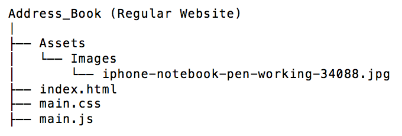

# Address Book

### Introduction

This website represents a practical contact management system.
The address book's code allows changes to get automatically 
saved in your browser. Meaning that any added / deleted person(s), or 
modifications done to elements within your address book will remain
after refreshing or closing your browser. Please note that your initial
contacts are fictional characters that were included by default.

### Link
Github Webpage: https://juan-moctezuma.github.io/Address-Book-Project/

### Does the code require a local web server to run?
No.

### Can this project become a Progressive Web Application (PWA)?
Yes. Please click the following link to observe the differences 
between a static / Vanilla JavaScript based website and a PWA.

Github Repository: https://github.com/Juan-Moctezuma/Address-Book-Project_v2-PWA

### Directory Tree

### Technologies
1. HTML5
2. CSS3
   * Responsive Framework: Bootstrap 4
3. JavaScript
   * ES6
   * jQuery
   * JSON
   * Regular Expressions (used for: Form-Validation)
